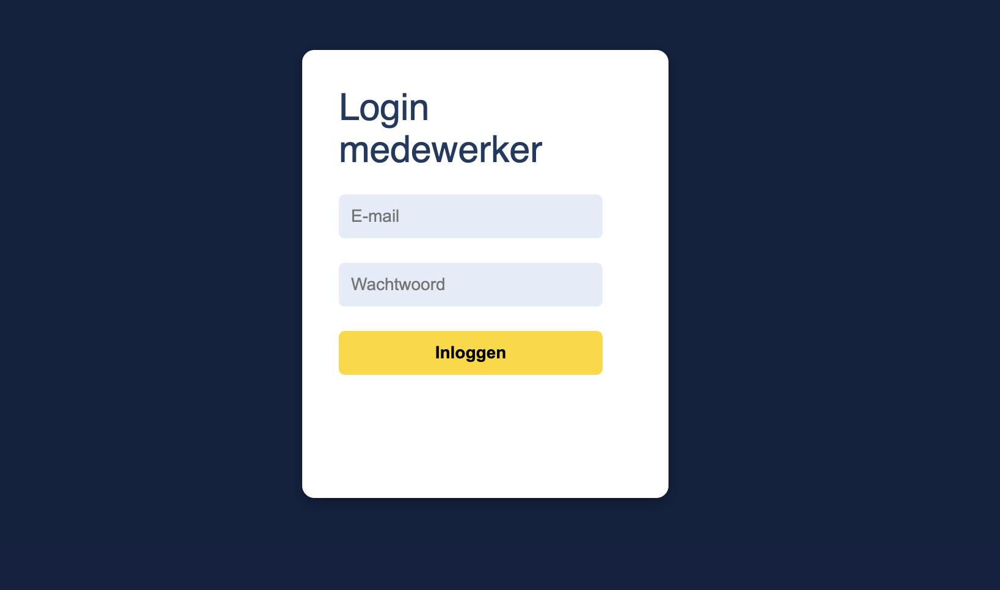
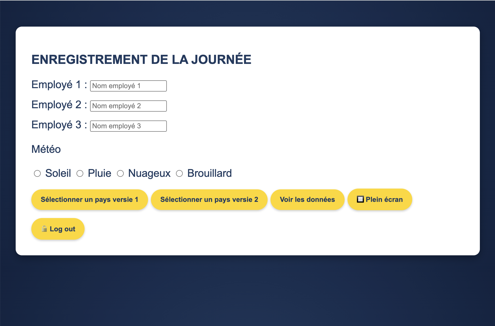
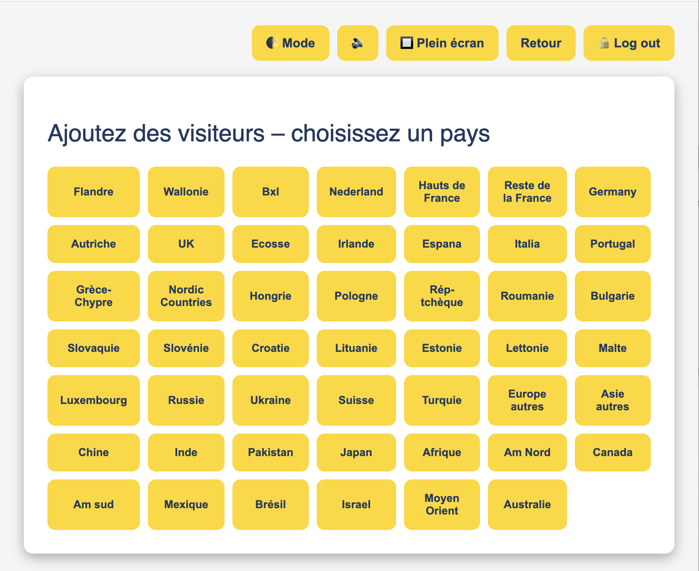
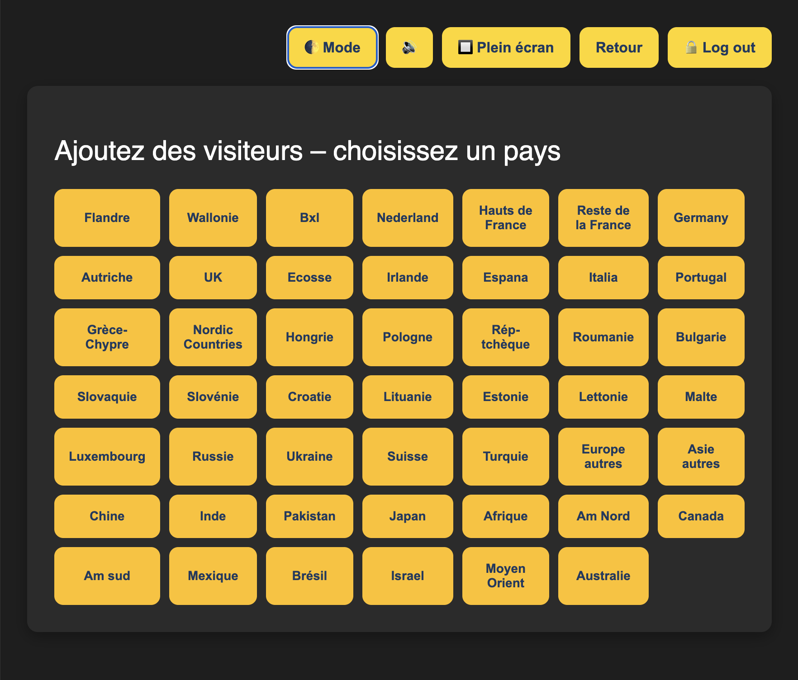
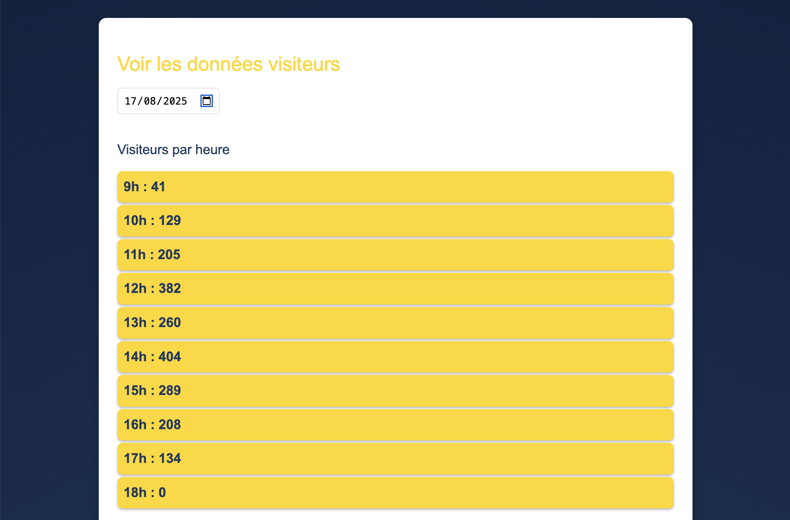
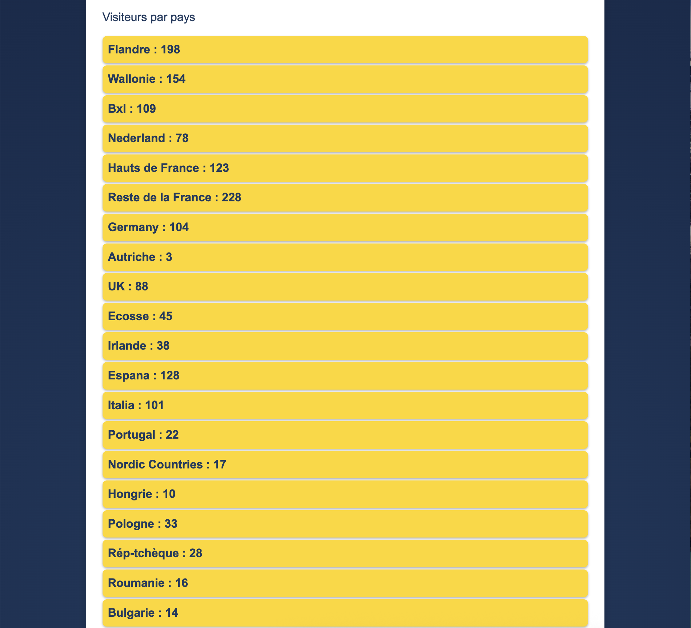
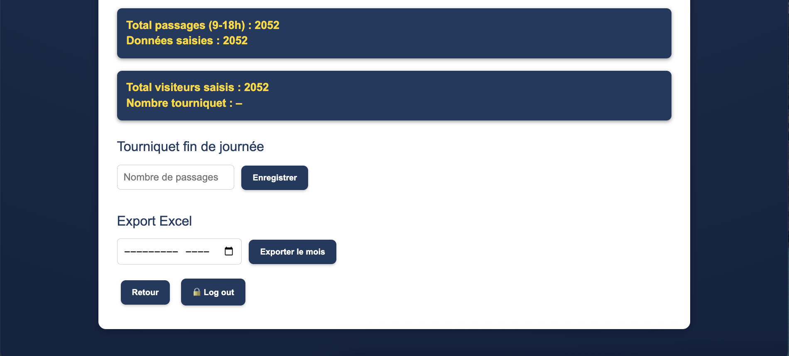

# 🌍 Mini-Europe Webapp

👩‍💻 **Independent freelance project** – developed individually for **Mini-Europe (Brussels)**.  
**Goal:** replace paper-based visitor surveys with a digital solution, giving the marketing team **real-time insights** into visitor origins.  
**Usage:** deployed on **tablets** and used daily by ticket staff at the entrance.  

🔗 **Live demo:** https://enquete-me.wbdesignpro.com/

---

## 📸 Screenshots (UI only)
*(No backend or sensitive data shown)*

### 🔑 Login

### 📝 Daily Inputs

### 🌍 Country Selection
  

### 📊 Visitor Statistics
**By hour**  

**By country**  

### 📤 Export & Totals

---

## 🚀 Features
- Fast **tablet UI** for staff (country & weather logging)
- Data stored via **Firebase** (Authentication + Realtime Database)
- **Analytics** views (by hour / by country)
- **Excel export** for monthly reporting

## 🛠 Tech Stack
HTML · CSS · JavaScript · **Firebase** (Auth + Realtime DB) · Elementor · Hostinger

## 👩‍💻 My Role
- **End-to-end owner**: design → implementation → deployment
- Firebase integration and secure data flow
- Built analytics views and export pipeline

## 🔒 Notes
This repository is a **case study** for portfolio purposes.  
No client credentials, secrets or private data are published.
